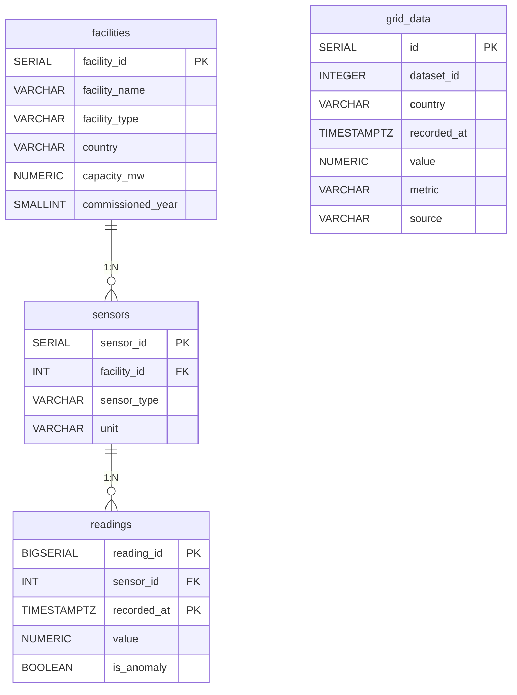
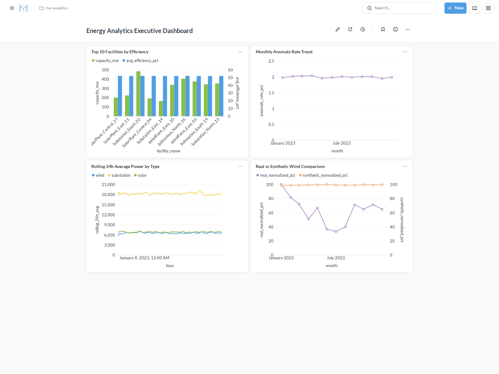
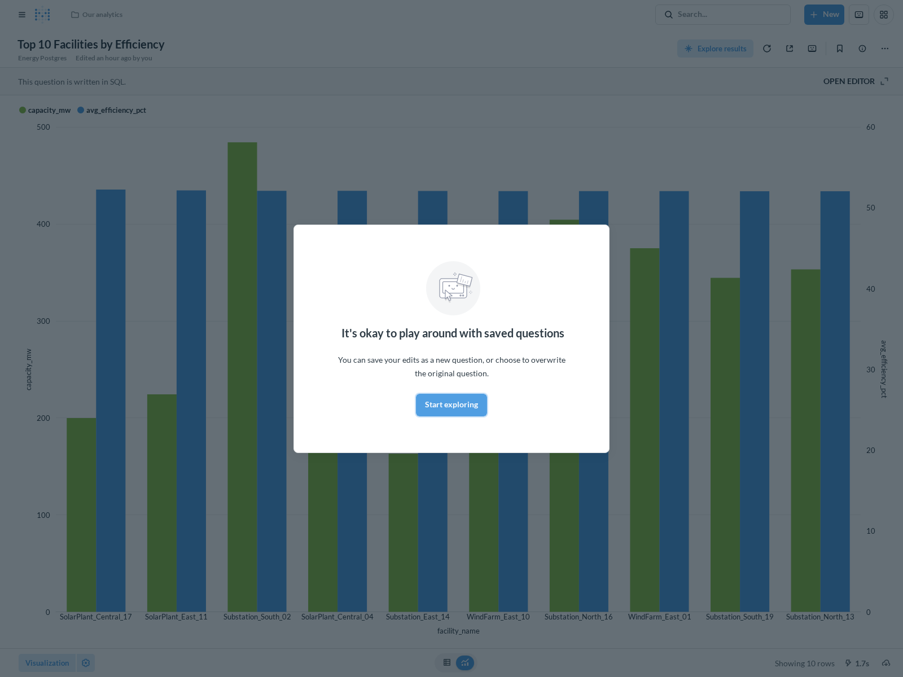
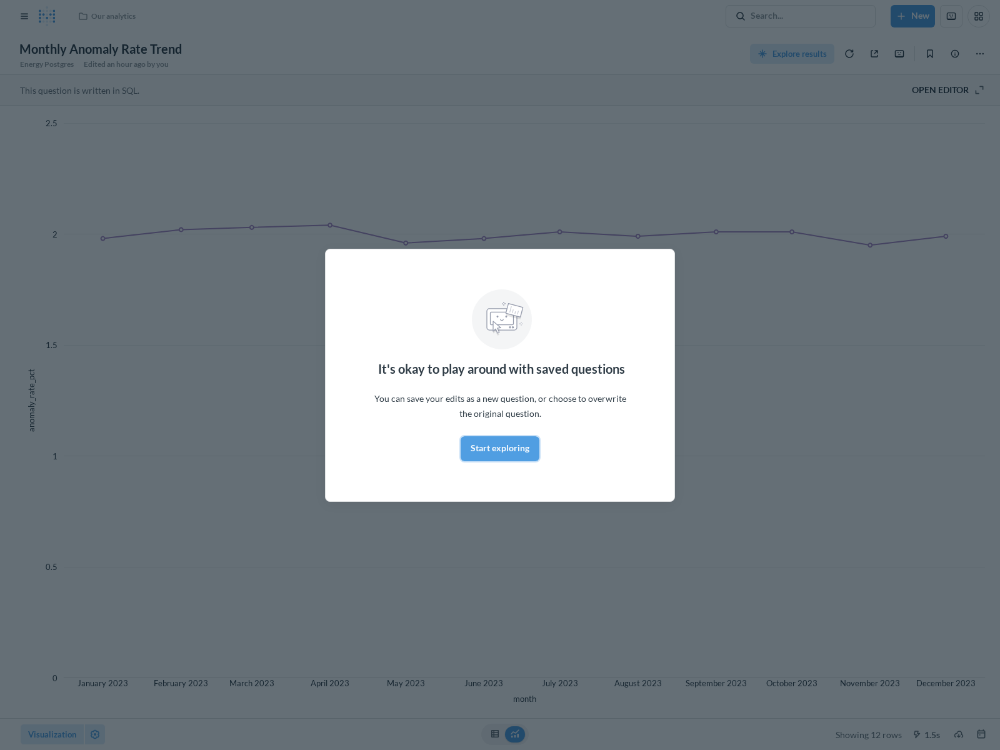
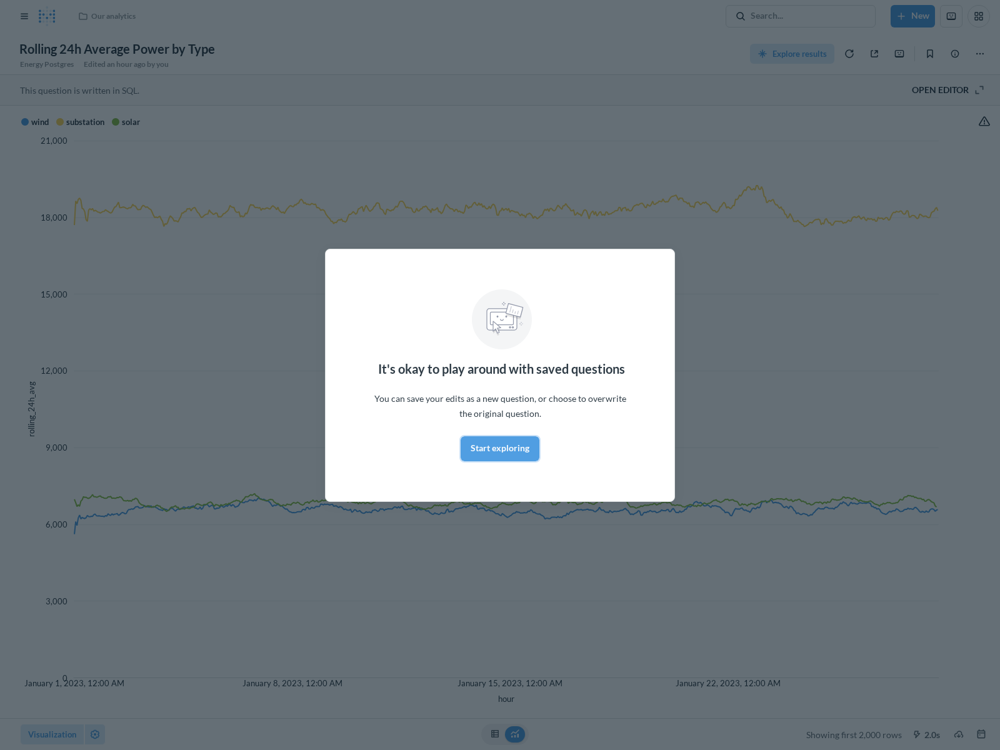
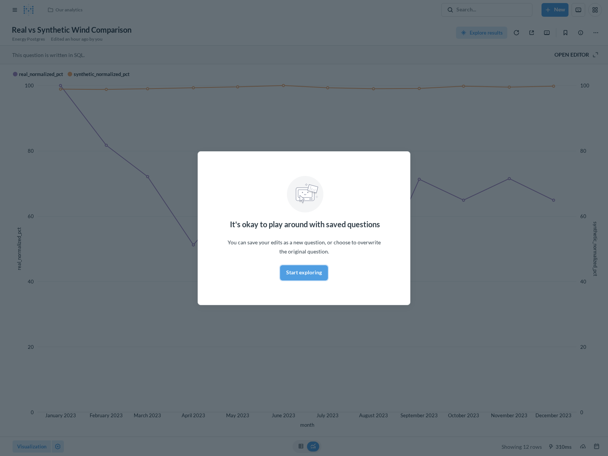

# Energy Facility Performance & Anomaly Analytics Platform

[](https://github.com/miladgk/energy-grid-sql-pipeline/actions/workflows/ci.yml)

A local data engineering project that ingests, transforms, and analyses
operational time-series data from a fictional network of 20 industrial energy
facilities (wind farms, solar plants, substations) across Scandinavia.
The project demonstrates a production-oriented pipeline: synthetic data
generation → PostgreSQL (Docker) → chunked Python ingestion → advanced SQL
analysis → automated CSV reporting → FastAPI JSON endpoint.

---

## Architecture

```
┌─────────────────────┐
│  generate_data.py   │  Creates ~6.3 M synthetic rows
│  (Pandas + NumPy)   │  at 5-minute resolution
└────────┬────────────┘
         │  data/raw/*.csv
         ▼
┌─────────────────────┐
│    ingest.py        │  Chunked loading (5 k rows/batch)
│    (psycopg2)       │  ON CONFLICT DO NOTHING — idempotent
└────────┬────────────┘
         │  SQL COPY
         ▼
┌─────────────────────────────────────────────────────┐
│              PostgreSQL 15  (Docker)                │
│                                                     │
│   facilities ──< sensors ──< readings               │
│                              (6.3 M rows, indexed)  │
└──────┬───────────────────────────────┬──────────────┘
       │  pandas.read_sql_query        │  psycopg2
       ▼                               ▼
┌─────────────────┐          ┌──────────────────────┐
│  run_report.py  │          │       api.py         │
│  SQL → CSV      │          │  FastAPI  :8000      │
│  outputs/*.csv  │          │  GET /api/anomalies  │
└─────────────────┘          └──────────────────────┘
```

---

## Entity-Relationship Diagram (ERD)

The database schema consists of three normalized core tables (`facilities`, `sensors`, `readings`) linked via foreign keys (`1:N` cardinality), alongside a standalone national-grid data table (`grid_data`). Note that `grid_data` is not FK-linked to `facilities` or `sensors` because it stores country-level macro measurements from Fingrid rather than individual facility sensor readings.



*(Note: `readings.value` and `readings.is_anomaly` are nullable in the live schema)*

---

## Tech Stack

| Layer         | Technology                          |
|---------------|-------------------------------------|
| Database      | PostgreSQL 15 (Docker Compose)      |
| Language      | Python 3.11                         |
| DB connector  | psycopg2                            |
| Data wrangling| pandas, NumPy                       |
| API           | FastAPI + Uvicorn                   |
| Testing       | pytest                              |
| Environment   | Conda                               |

---

## Project Structure

```
energy-analytics-sql/
│
├── benchmarks/
│   └── index_benchmark.md      # Composite index & range partitioning EXPLAIN ANALYZE proof
├── docker-compose.yml          # PostgreSQL 15 & Metabase containers — one command setup
├── environment.yaml            # Conda environment
├── config_template.yaml        # DB credentials template (config.yaml is git-ignored)
├── .gitignore
├── README.md
│
├── data/
│   ├── raw/                    # Generated CSVs (git-ignored due to size)
│   └── processed/              # Optional hand-crafted exports
│
├── sql/
│   ├── schema/
│   │   ├── 01_create_tables.sql
│   │   └── 10_partition_readings.sql # Declarative range partitioning (monthly)
│   ├── etl/
│   │   └── 02_data_quality_checks.sql
│   └── analysis/
│       ├── 03_rolling_averages.sql
│       ├── 04_anomaly_detection.sql
│       ├── 05_facility_ranking.sql
│       ├── 06_monthly_report.sql
│       ├── 08_real_vs_synthetic_comparison.sql
│       └── 09_top_readings_per_sensor.sql # Correlated LATERAL join queries
│
├── src/
│   ├── setup_db.py             # Runs 01_create_tables.sql (fallback for non-Docker setups)
│   ├── generate_data.py        # Synthetic & incremental data generator
│   ├── db_connection.py        # Credential-safe psycopg2 factory
│   ├── ingest.py               # Chunked & incremental CSV → PostgreSQL pipeline
│   ├── migrate_to_partitioned.py # Live table migration to range-partitioned schema
│   ├── fetch_grid_data.py      # Real Fingrid API ingestion client
│   ├── ingest_grid_data.py     # Grid data PostgreSQL loader
│   ├── run_quality_checks.py   # Runs 02_data_quality_checks.sql, prints results
│   ├── run_report.py           # Runs all analysis SQL → timestamped CSVs
│   └── api.py                  # FastAPI service (anomalies, rankings)
│
├── tests/
│   ├── test_data_quality.py    # pytest suite for post-ingestion assertions
│   └── test_incremental.py     # Two-layer idempotency verification tests
│
└── outputs/                    # Auto-generated report CSVs land here
```

---

## Setup Instructions

### 1 — Clone and create the Conda environment

```bash
git clone https://github.com/miladgk/energy-grid-sql-pipeline.git
cd energy-grid-sql-pipeline

conda env create -f environment.yaml
conda activate energy-analytics
```

> [!NOTE]
> **Python-only setup:** If you are not using Conda, you can create a virtual environment and install the pinned dependencies using pip:
> ```bash
> pip install -r requirements.txt
> ```


### 2 — Start PostgreSQL with Docker Compose

```bash
docker-compose up -d
```

This spins up a PostgreSQL 15 container on `localhost:5432` and
automatically runs `sql/schema/01_create_tables.sql` on first boot
(via the `docker-entrypoint-initdb.d` mount).

To verify it is healthy:

```bash
docker-compose ps
# State should show "healthy"
```

> **Non-Docker / schema reset:** If you are using a bare-metal Postgres
> install, or you need to reset the schema after a `docker volume rm`,
> run the schema script manually:
>
> ```bash
> python src/setup_db.py
> ```
>
> This reads and executes `sql/schema/01_create_tables.sql` directly.
> It is idempotent — safe to re-run on an existing database.

### 3 — Configure database credentials

```bash
cp config_template.yaml config.yaml
```

Edit `config.yaml` with the credentials from `docker-compose.yml`:

```yaml
database:
  host: localhost
  port: 5432
  dbname: energy_analytics
  user: admin
  password: password
```

> `config.yaml` is in `.gitignore` and is **never committed**.

### 4 — Generate synthetic data

```bash
python src/generate_data.py
```

This writes ~6.3 million rows to `data/raw/readings.csv` (and the two
smaller files). Expect ~45 seconds on a modern laptop.

### 5 — Ingest into PostgreSQL

```bash
python src/ingest.py
```

Reads each CSV in 5,000-row chunks and bulk-inserts into PostgreSQL.
Expect 3–8 minutes for the full readings table.

`ingest.py` automatically calls `run_quality_checks.py` when it
finishes, so `02_data_quality_checks.sql` is always executed immediately
after a load. The process exits with code `1` if any check fails.

### 5a — Incremental Ingestion & Idempotency Verification

The pipeline employs a **two-layered defense** against duplicate data insertion:

1. **Application-Level High-Watermark Filter (`--incremental` mode):**
   Before loading CSV chunks, `ingest.py` queries `SELECT MAX(recorded_at) FROM readings;` and preemptively filters out incoming rows where `recorded_at <= watermark`. This saves database CPU, I/O, and transaction log overhead when re-running against historical files.
2. **Database-Level Constraint Deduplication (`ON CONFLICT`):**
   If duplicate rows arrive within a new batch (or if the application watermark is bypassed via `--no-watermark`), PostgreSQL's composite primary key `(reading_id, recorded_at)` catches the collision and `ON CONFLICT DO NOTHING` silently drops the duplicate records without aborting the transaction.

```bash
# Generate one new day of data for Jan 1, 2024
python src/generate_data.py --incremental --date 2024-01-01

# 1. First run: Ingests the 17,280 incremental rows normally
python src/ingest.py --incremental

# 2. Second run: Inserts 0 rows because the Application High-Watermark filter catches them
python src/ingest.py --incremental

# 3. Third run: Bypasses the watermark to prove Database-level ON CONFLICT DO NOTHING rejects duplicates
python src/ingest.py --incremental --no-watermark
```

### 6 — Run data quality checks (standalone)

The quality checks also run independently at any time:

```bash
python src/run_quality_checks.py
```

This executes `sql/etl/02_data_quality_checks.sql` and prints a
formatted table for each of the four checks. It exits with code `1` if
any check detects a problem, making it usable as a CI gate.

### 7 — Run pytest assertions

```bash
pytest tests/ -v

```

All six assertions should pass across both test suites (`test_data_quality.py` and `test_incremental.py`):

- No sensors without readings
- Zero NULL values
- Anomaly rate in [1 %, 4 %]
- 365+ days of coverage
- Row count within 5 % of 6,307,200
- Strict idempotency on duplicate batch loads (Watermark & ON CONFLICT)

### 8 — Run the analysis report

```bash
python src/run_report.py
```

Executes the four analysis SQL files in order and writes timestamped
CSVs to `outputs/`.

### 9 — Start the API

```bash
uvicorn src.api:app --reload --port 8000
```

Open `http://localhost:8000/docs` for the auto-generated Swagger UI.

### 10 — Start and Provision Executive Dashboard (Metabase)

Start the Metabase Docker container alongside PostgreSQL:

```bash
docker compose up -d metabase
```

Once running (`http://localhost:3000`), provision the database connection and native SQL charts automatically via the REST API:

*(Note: The Metabase provisioning and screenshot scripts require additional dependencies. Install them first with `pip install -r requirements-dev.txt`)*

```bash
python scripts/setup_metabase.py
```

> **Security Caveat**: Metabase runs locally inside Docker (`http://localhost:3000`) and connects securely to the PostgreSQL container via Docker networking (`energy_analytics_db:5432`). For privacy and safety, no public unauthenticated endpoint or external sharing link is exposed.

---

## SQL Techniques Demonstrated

| Technique | Where |
|---|---|
| **CTEs** (`WITH` clauses) | All analysis files — multi-step transformations broken into readable named steps |
| **Window functions** (`AVG OVER`, `ROWS BETWEEN`) | `03_rolling_averages.sql` — 24-hour trailing average per facility |
| **`RANK()`, `DENSE_RANK()`, `NTILE()`, `PERCENT_RANK()`** | `05_facility_ranking.sql` — global rank, within-type rank, performance quartile |
| **`LAG()` for time-series** | `06_monthly_report.sql` — month-over-month energy change |
| **Z-score anomaly detection** | `04_anomaly_detection.sql` — statistical outlier detection via `STDDEV()` and CTE pipeline |
| **`FILTER` aggregation** | `02_data_quality_checks.sql`, `06_monthly_report.sql` — conditional counts without subqueries |
| **`NULLIF` for safe division** | `05_facility_ranking.sql`, `06_monthly_report.sql` — prevents division-by-zero |
| **`DATE_TRUNC` + `TO_CHAR`** | All analysis files — period aggregation and formatted output |
| **Composite indexes** | Schema — `(sensor_id, recorded_at)` index cuts query execution time from 13.4ms to 0.36ms (97.3% reduction). See [index_benchmark.md](benchmarks/index_benchmark.md) for execution plans. |
| **`ON CONFLICT DO NOTHING`** | `ingest.py` — idempotent ingestion; safe to re-run the pipeline |
| **LATERAL joins** | `09_top_readings_per_sensor.sql` — per-sensor top-N without a window function subquery |
| **Range Partitioning** | `10_partition_readings.sql` — time-based declarative table partitioning. See [index_benchmark.md](benchmarks/index_benchmark.md) for partition pruning benefits. |

---

## Sample Output — Facility Ranking (05)

```
facility_name            facility_type  country   capacity_mw  avg_efficiency_pct  overall_rank  rank_within_type  performance_quartile  percentile
-----------------------  -------------  --------  -----------  ------------------  ------------  ----------------  --------------------  ----------
SolarPlant_East_07       solar          Denmark        87.43               38.21             1                 1                     1       100.0
WindFarm_North_03        wind           Norway        412.50               37.84             2                 1                     1        94.7
SolarPlant_Central_12    solar          Sweden        203.11               36.90             3                 2                     1        89.5
WindFarm_South_01        wind           Finland       298.00               35.43             4                 2                     1        84.2
Substation_West_18       substation     Denmark        55.00               34.71             5                 1                     1        78.9
...
```

---

## Sample Output — Anomaly Detection (04) top-5

```
reading_id  sensor_id  recorded_at               value      z_score  facility_name          sensor_type   was_flagged_in_source
----------  ---------  ------------------------  ---------  -------  ---------------------  ------------  ---------------------
4821903     17         2023-07-14T13:35:00+00    1247.5000    18.43  WindFarm_North_03      power_output  true
1093421     5          2023-03-02T08:10:00+00    -62.0000     16.21  SolarPlant_East_07     temperature   true
6102847     42         2023-11-29T22:45:00+00     75.0000     15.87  Substation_West_18     wind_speed    true
2984510     23         2023-05-18T14:20:00+00    904.0000     14.92  WindFarm_South_01      power_output  true
5417623     38         2023-09-07T06:55:00+00   -64.5000     13.54  SolarPlant_Central_12  temperature   true
```

---

## Real vs. Synthetic Wind Pattern Validation

To validate the synthetic data generator against reality, daily average wind production patterns were compared against real Fingrid grid data for Finland (2023) using z-score standardization. The analysis yielded a Pearson correlation coefficient of **-0.0614** over a sample size of **n = 365** days (degrees of freedom **df = 363**). With a p-value of **0.242**, this correlation is **not statistically significant** at the conventional α = 0.05 threshold. This result shows no statistically detectable relationship between the synthetic and real wind patterns — consistent with the synthetic generator's known lack of seasonal modeling, since it produces a nearly flat capacity factor year-round while real Nordic wind production varies strongly by season. Surfacing this result, rather than reporting only the earlier (statistically underpowered) monthly comparison, demonstrates how real-world API data can be used to rigorously audit simulation assumptions. See `outputs/08_real_vs_synthetic_comparison.csv` for the full daily breakdown.

---

## Executive Business Intelligence Dashboard (Metabase)

To make the SQL analytics accessible and actionable for executive decision-makers and data analysts, we built an interactive Metabase dashboard over our PostgreSQL warehouse.

```
+---------------------------------------------------------------------------------------------+
|                            ENERGY ANALYTICS EXECUTIVE DASHBOARD                             |
+------------------------------------------------------------------------+--------------------+
|  [Bar Chart] Top 10 Facilities by Efficiency                           |  [Line Chart]      |
|  Visualises ranking from 05_facility_ranking.sql                       |  Monthly Anomaly   |
|  Identifies highest-performing solar & wind plants                     |  Rate Trend (04)   |
+------------------------------------------------------------------------+--------------------+
|  [Line Chart] Rolling 24h Average Power by Type                        |  [Line Chart]      |
|  Demonstrates window functions (AVG OVER 23 PRECEDING) from 03         |  Real vs Synthetic |
|  Compares solar vs wind diurnal generation curves                      |  Wind Patterns (08)|
+------------------------------------------------------------------------+--------------------+
```

### Full Dashboard Overview


### 1. Top 10 Facilities by Efficiency


### 2. Monthly Anomaly Rate Trend


### 3. Rolling 24h Average Power by Facility Type


### 4. Real vs. Synthetic Wind Pattern Comparison
